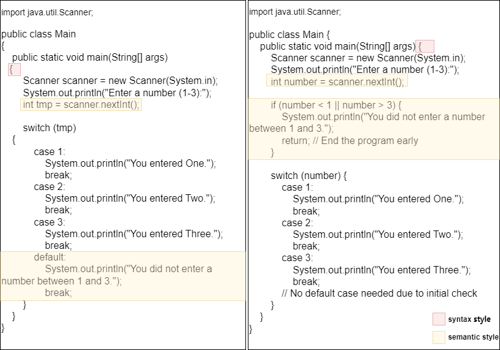
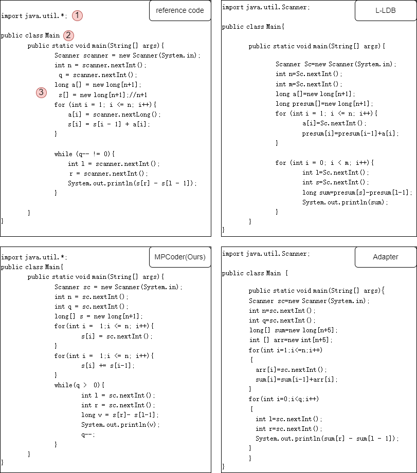

## Examples of syntax and semantic differences of coding styles

Both copies of the code solve the same problem, but the code reflects different syntax and semantic styles.

### Syntax style differences:
"{" in one copy of the code in the peer, the other code is not in the peer. It reflects the grammatical style difference in the format.

### Semantic style differences:
1. One copy of the code uses "tmp" as a temporary variable name, and the other uses "number" as a numerical variable name, reflecting different semantic styles in naming meanings.

2. One code uses defualt in the Switch, and the other code does not use defualt, the functions of the two codes are consistent, but the order of actual program execution may not be consistent, one runs to the end of the output, and the other code outputs and terminates the program at the beginning. The two pieces of code represent different data flows, or design patterns, that reflect the semantic style of the developer.

## Comparative qualitative examples of our model

The figure shows the personalized code of the same question for the same user under different models. Significant differences are highlighted in red, showing that our model aligns more closely with the overall style of the user's reference code than those of Adapter and L-LDB.

